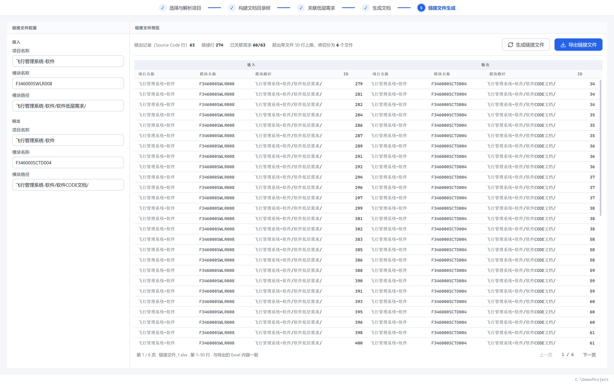
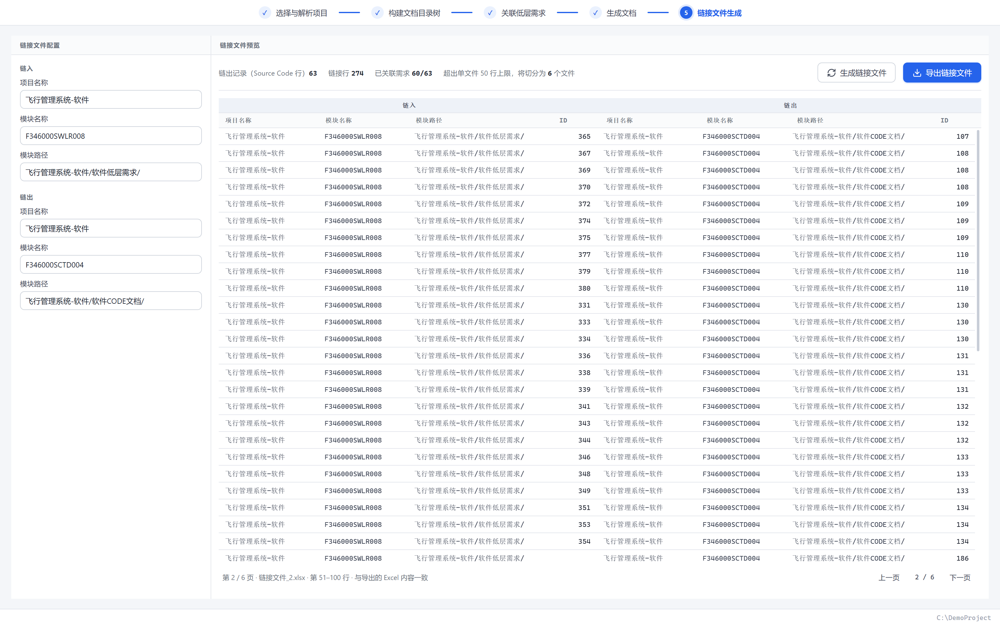

# CodeDocBench 用户手册

从零开始，手把手带您完成一次完整的代码文档生成。

> 本手册所有截图均基于示例项目 `DemoProject`（一个多目录 C 工程）与示例低层需求文件 `Demo_LLR_Requirements.xlsx` 演示。

---

## 1. 软件简介

CodeDocBench 是一款面向 C 项目的代码文档生成桌面工具。它解析源码中的函数、结构体、宏、全局变量等符号，引导您构建文档目录树、关联低层需求（LLR），最终导出结构化的代码文档 Excel。

启动软件后，您会看到五个步骤组成的流程导航条，以及底部的状态栏：


- **顶部导航条**：五个步骤依次为「选择与解析项目 → 构建文档目录树 → 关联低层需求 → 生成文档 → 链接文件生成」。点击步骤文字即可切换（未解锁的步骤为灰色，不可点击）。
- **底部状态栏**：左侧显示操作提示与错误信息，右侧显示当前项目的完整路径。

---

## 2. 第一步：打开并解析项目

### 2.1 打开项目

点击左侧的「**打开项目目录**」卡片，在弹出的系统对话框中选择您的 C 项目根目录（如 `C:/DemoProject`），软件会**自动扫描并解析**整个目录。


扫描完成后：

- 左侧列出项目的目录与源码文件（自动跳过 `.git`、`build`、`node_modules` 等目录，只保留 `.c/.h/.cpp` 等可解析文件）；
- 左上角出现**项目条**，显示当前项目名（悬停可查看完整路径）；
- 底部状态栏右侧显示项目根路径；
- 点击任意 `.c` / `.h` 文件，右侧即展示该文件的解析结果：函数、结构体、宏、全局变量等分类明细与统计。


### 2.2 刷新与关闭项目

在左侧目录树区域**点击鼠标右键**，弹出项目菜单：


- **刷新项目**：重新扫描项目目录。新增/删除/修改的文件会同步更新；已挂载文件的解析数据也会随之刷新（仅重新解析被修改过的文件）。
- **关闭项目**：清空当前项目与文档目录树，回到初始状态。

> 💡 文档目录树自动保存在项目根目录下的 `.codedocbench.json` 文件中，随项目移动或复制到其他电脑都不会丢失。关闭软件后重新打开，上次的项目会自动恢复。

---

## 3. 第二步：构建文档目录树

项目解析完成后，点击顶部导航条中的「**2 构建文档目录树**」进入第二步。


页面分为左右两栏：

- **左侧「文档目录树」**：您要生成的文档的章节结构；
- **右侧「项目文件目录树」**：项目源码文件，用于挑选并挂载到章节下。

### 3.1 添加章节

1. 点击左栏工具栏的「**章节**」按钮：未选中任何节点时，新增**一级章节**；选中某个章节时，在其下新增**子章节**；
2. 新章节立即进入命名状态，输入名称后按 **Enter** 确认（按 **Esc** 取消）；
3. 双击任意章节可随时重命名，或使用工具栏「重命名 / 删除」按钮。

### 3.2 展开与折叠

- 每个有子节点的节点前有**折叠箭头**，点击即可展开/折叠；
- 工具栏「**展开 / 折叠**」按钮可一键展开或折叠全部层级。

### 3.3 筛选与挂载源码文件

挂载是把源码文件“归属”到某个章节下，导出时该文件的解析内容会出现在该章节中：

1. 在左侧**选中一个章节**作为挂载目标；
2. 右侧通过「**类型**」筛选条按后缀筛选文件（如只看 `.c` 文件，chip 上标有该类型的文件数量；再次点击或点「全部」恢复）；
3. **勾选文件**：文件前的复选框逐个勾选；**勾选目录**可一次选中其下所有文件（父目录复选框会显示半选状态）；
4. 点击「**挂载到选中节点**」，完成挂载。


挂载后，每个源码文件自动生成数据子章节：

| 文件类型 | 自动生成的子章节 |
|---|---|
| `.c` | Type Definition、Global Variable Definition、Macro Definition、Constant Definition、**Function Definition**（5 章） |
| `.h` | Type Definition、Global Variable Definition、Macro Definition、Constant Definition（4 章，不含函数） |

每个子章节下会列出从源码中解析出的符号名（如函数名、宏名）。挂载完成后，「3 关联低层需求」步骤自动解锁。

---

## 4. 第三步：关联低层需求

点击「**3 关联低层需求**」进入第三步。


1. 点击「**选择 Excel 文件**」，选择您的低层需求文档（参考 `Demo_LLR_Requirements.xlsx`：包含 `Requirement ID`、`Section`、`Title / Requirement Text`、`Type` 列）；
2. 在「**列映射**」中指定各列的位置（下拉列表第一项「（未指定）」表示不映射）：
   - **章节列**：需求文档的章节编号列（如 `Section`）。⚠️ 强烈建议映射，否则函数与需求的关联边界可能不准确；
   - **ID 列**：需求编号列（如 `Requirement ID`）。不映射则所有函数的 Parent ID 为空；
   - **需求内容列**：需求文本列（如 `Title / Requirement Text`）。不映射则无法定位需求行；
   - **Object Type 列**：类型列（如 `Type`）。用于识别并排除 `Comment` 行，也是第 5.3 节「视角二」判定需求行的依据；不映射时视角二会退化为「所有带 ID 的行」，报告中会明确提示；
3. 右侧**数据预览**即时展示文件内容（表头固定、表体滚动）。

> 💡 四项映射随项目一起保存在 `.codedocbench.json`；下次打开同一项目会自动回填。若低层需求文件被其他程序改过，预览与导出前会按修改时间自动重读，无需重新选择。

---

## 5. 第四步：生成文档

点击「**4 生成文档**」进入第四步。页面即为**将要导出的 Excel 内容预览**，与导出文件完全一致：


确认无误后，点击右上角「**生成并导出 Excel**」，选择保存位置即可完成导出。

### 5.1 导出 Excel 的格式

| 列 | 规则 |
|---|---|
| 章节号 | 按目录树层级生成（如 `1.1.2`） |
| 需求内容 | 标题行（有章节号）**加粗**显示；数据行为符号名；解析不到时为 `N/A` |
| Object Type | **仅** Global Variable Definition 与 Function Definition 两章的数据行为 `Source Code`；Type / Macro / Constant Definition 三章的数据行记为 `Comment`；`N/A` 占位行记为 `Comment` |
| Parent ID | 仅函数行填写：该函数在低层需求文档中对应的所有需求行 ID（每行一个，排除 `Comment` 行）；其余行为空 |

> **为什么只有两章是 `Source Code`？** Parent ID 只在函数章生成。Type / Macro / Constant 是「代码里存在、但不承载需求追溯」的符号，把它们算作 `Source Code` 会让后续的一致性校验把它们误判成「Parent ID 缺失」的数据缺陷。了解这一点有助于看懂第五步与第 5.3 节的统计数字。

**Parent ID 关联规则**：低层需求文档中「文档编号到函数名为止」——需求内容列的值恰为函数名的行是函数名行，其后到下一个标题行之前的行都是该函数的需求内容行；函数行的 Parent ID 即这些需求行（排除 `Comment`）的 ID 集合。例如示例中函数 `Demo_Fn_026` 的 Parent ID 为：

```
DEMO_LL_R_4
DEMO_LL_R_6
DEMO_LL_R_7
DEMO_LL_R_8
```

### 5.2 导出前的自动检查

导出时会自动执行一致性自检（行号越界、重复符号、章节列未映射、Parent ID 未在需求 ID 列中找到、函数未关联需求、跨文件同名函数、需求块同名或未覆盖等）。发现异常会列出明细，由您确认后再决定是否继续导出。

### 5.3 一致性校验报告

第四步工具栏上还有一个「**导出检查报告**」按钮。点击后会按当前文档目录树与低层需求做**双向追溯覆盖**核对，并把结论导出为 `一致性检查报告.xlsx`（导出后会弹窗给出两视角摘要）。它检查的是两个方向：

| 方向 | 检查内容 |
|---|---|
| **视角一 · 代码文档** | `Source Code` 的行中，哪些 `Parent ID` 为空（按数据章节分组统计） |
| **视角二 · 低层需求** | `Requirement` 的需求中，哪些 ID 从未被代码文档的 `Parent ID` 引用 |

报告含三个工作表：

- **校验汇总**：两视角的分母 / 命中数 / 占比，外加悬空引用、重复追溯、口径差异三项附带核对，表格下方竖排嵌入 4 张图表；
- **代码侧-SourceCode明细**：全量 `Source Code` 行（文档序号 / 章节号 / 需求内容 / Parent ID），**Parent ID 为空的行整行浅红着色**；
- **需求侧-一致性明细**：全量 `Requirement` 行及其被引用的代码文档行，一条需求被多行引用时逐引用展开，**未被引用的行整行浅红着色**。

明细中的「文档序号」与导出文档的序号列、链接文件的「链出 ID」是同一坐标系，可直接回表定位。列映射缺失时报告会如实降级并提示（例如未映射 `Object Type` 列时，视角二退化为「所有带 ID 的行」）。

---

## 6. 第五步：链接文件生成

第五步用于生成**低层需求 ↔ 代码文档**的链接关系表（追溯矩阵），供导入系统入库。



### 6.1 填写链入 / 链出信息

左侧按「链入」「链出」两侧各填三项：

| 侧 | 字段 | 含义 | 示例 |
|---|---|---|---|
| 链入 | 项目名称 / 模块名称 / 模块路径 | 低层需求侧的归属信息 | 飞行管理系统-软件 / F346000SWLR008 / 飞行管理系统-软件/软件低层需求/ |
| 链出 | 项目名称 / 模块名称 / 模块路径 | 代码文档侧的归属信息 | 飞行管理系统-软件 / F346000SCTD004 / 飞行管理系统-软件/软件CODE文档/ |

这三项随项目保存在 `.codedocbench.json` 中，下次打开项目会自动回填。

### 6.2 生成与预览

点击「**生成链接文件**」，右侧即出现预览表。表头为两行分组形式：

| 链入 | | | | 链出 | | | |
|---|---|---|---|---|---|---|---|
| 项目名称 | 模块名称 | 模块路径 | ID | 项目名称 | 模块名称 | 模块路径 | ID |

**ID 的取值规则**（两端不对称，注意区分）：

- **链出 ID** = 该符号在**导出文档表中的序号**（不是章节号）。因此只要文档目录树不变，序号即稳定；
- **链入 ID** = 该符号关联的需求 ID，**按 `_` 下划线切分后取最后一段**作为数值部分。例如 `DEMO_LL_R_123` → `123`、`F346000SWLR008_6094` → `6094`。前缀形态不固定，软件不做硬编码假设；
- 一个符号关联多条需求时，**拆成多行**（链出 ID 相同、链入 ID 各占一行）；
- 未关联到需求的符号行，链入 ID 留空。

预览区顶部的统计会显示：链出记录数（`Source Code` 行数）、链接行数、已关联需求数，以及是否需要分片。

### 6.3 分片导出

受导入系统限制，单个链接文件最多容纳 **50 行数据**（两行表头不计入）。超出时软件按行序自动切分成多个文件：

- 单文件：`链接文件.xlsx`（走系统「另存为」对话框，可自定文件名）；
- 多文件：`链接文件_1.xlsx`、`链接文件_2.xlsx`…（片数 ≥ 10 时补零为 `_01`），点击导出后**先选择导出目录**，软件会在覆盖前列出将被覆盖的文件并请求确认。

预览区按同一口径**分页**：一页正好对应一个导出文件，页脚给出「第 N / M 页 · 文件名 · 行区间」，配「上一页 / 下一页」。



图中示例：第 2 / 6 页对应 `链接文件_2.xlsx`，行区间 51–100。**翻页只影响预览，点击导出始终导出全部文件。**

链出 ID 跨片不重编（保持导出文档的原序号），因此各片之间的 ID 本就跳号，这是预期行为。

---

## 7. 常见问题

**Q：扫描失败怎么办？**
检查底部状态栏的错误信息：目录不存在、无读取权限是最常见原因。确认路径后可通过右键菜单「刷新项目」重试。

**Q：误点了网页式的“刷新”会丢数据吗？**
桌面端已禁用 WebView 默认右键菜单；文档目录树自动保存在项目目录下（`.codedocbench.json`），即使窗口意外重载也会自动恢复。

**Q：为什么我的 `.h` 文件没有 Function Definition 章节？**
这是设计如此：头文件只有类型、全局变量、宏、常量 4 个数据章节。

**Q：函数行的 Parent ID 是空的？**
请确认：① 第三步已选择低层需求 Excel；② 「ID 列」「需求内容列」已正确映射；③ 建议映射「章节列」；④ 低层需求文档中存在与源码函数**同名**的函数名行。

**Q：改了源码文件，为什么文档里的内容没变？**
解析结果按文件修改时间（mtime）缓存：文件被外部修改后会自动重新解析并刷新。如果内容确实与源码不符，可用右键菜单「**刷新项目**」强制全量重扫。

**Q：低层需求 Excel 用别的程序改过了，软件会读到新内容吗？**
会。第三步关联时会记录该文件的修改时间，在预览与导出前检测到外部修改会自动重读，无需手动重选。

**Q：一致性校验报告里「Global Variable Definition」章的 Parent ID 全是空的，是 bug 吗？**
不是。Parent ID 只在函数章生成，这是设计上的结构性事实。因此报告的视角一按数据章节分组呈现——请重点看 **Function Definition** 章的空值数，那才是真正需要补需求追溯的缺口。

**Q：换了电脑数据还在吗？**
在。文档目录树保存在**项目目录**下的 `.codedocbench.json`，随项目一起移动、备份、换机都不丢失（软件安装目录本身不存任何数据）。只有「上次打开的项目路径」这个指针存在本机，换机后重新选择项目目录即可自动恢复该项目的目录树。

**Q：导出的链接文件 ID 该填到导入系统的哪个字段？**
链出 ID 对应代码文档的「序号」，链入 ID 对应低层需求编号。注意链入 ID 已去掉下划线前缀（只保留数值部分），若导入系统要求完整 ID，请自行补回前缀。

---

*CodeDocBench · C 代码解析与文档生成*
