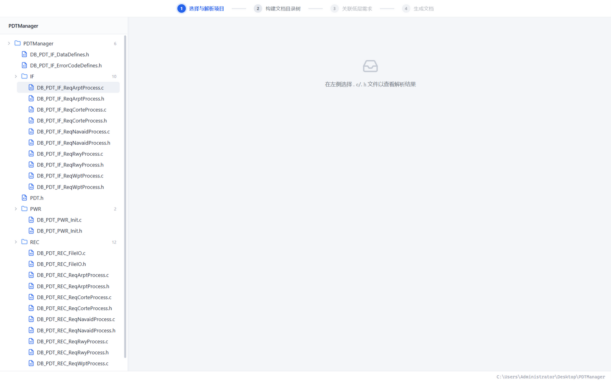
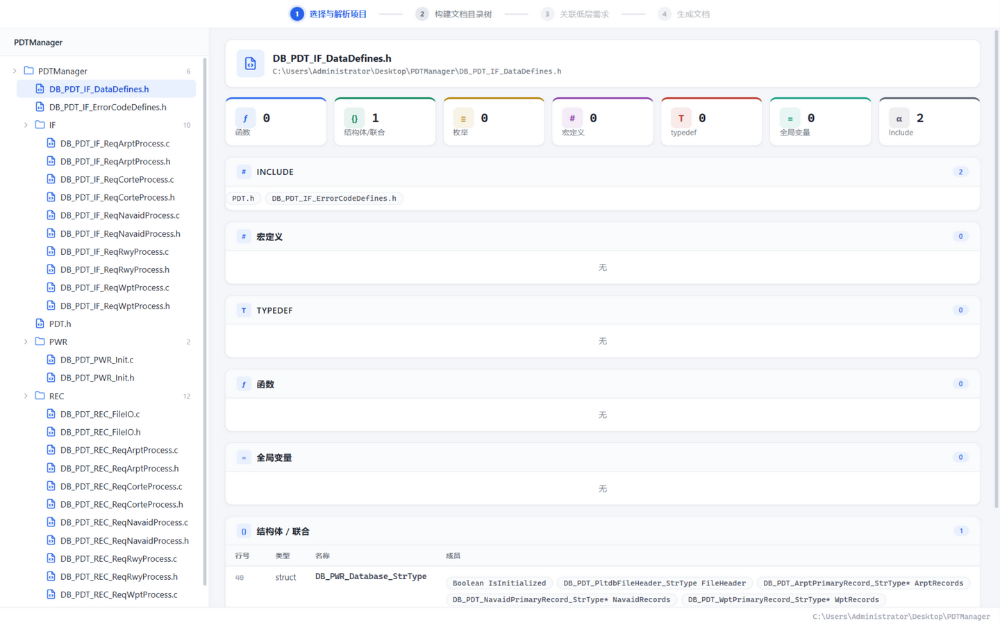
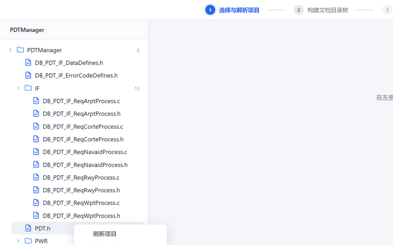
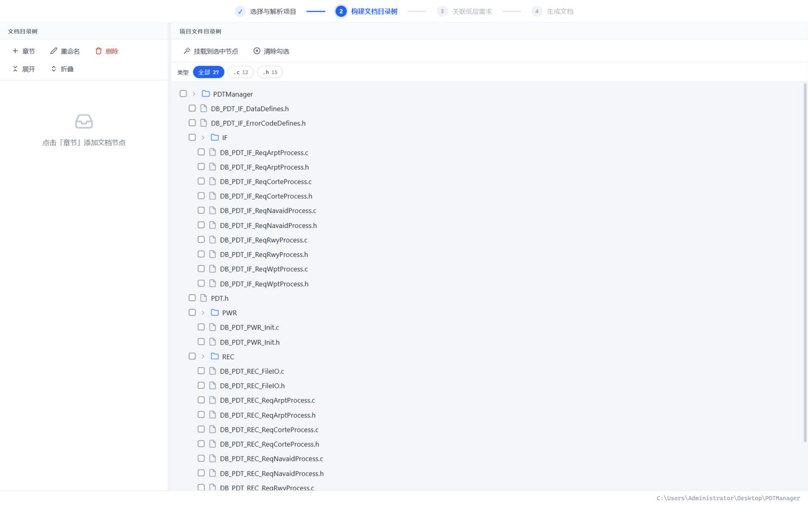
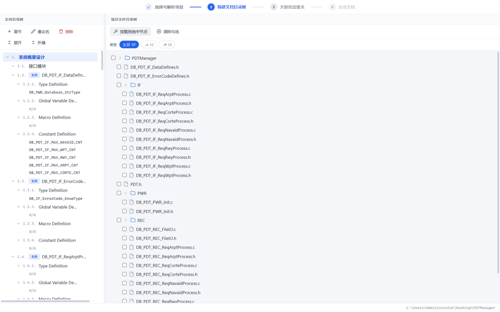
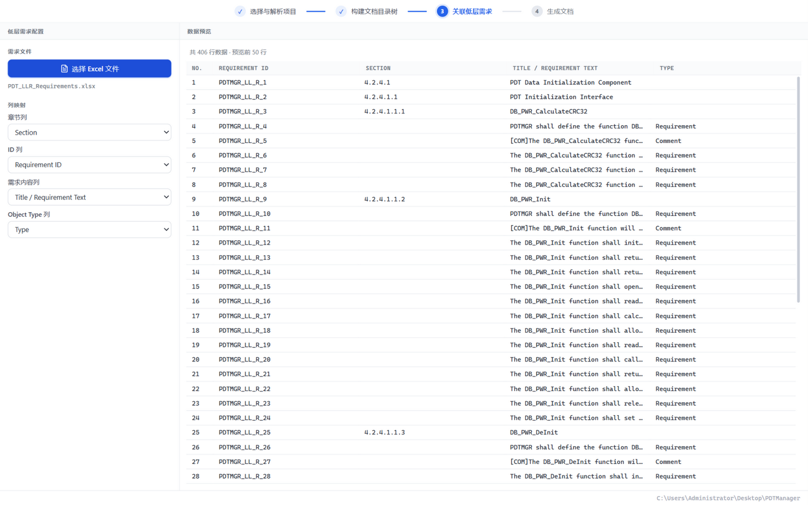
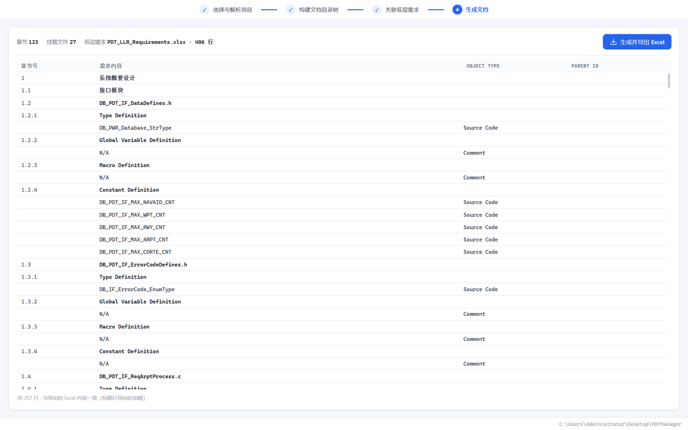

# CodeDocBench 用户手册

从零开始，手把手带您完成一次完整的代码文档生成。

> 本手册所有截图均基于示例项目 `PDTManager`（一个多目录 C 工程）与示例低层需求文件 `PDT_LLR_Requirements.xlsx` 演示。

---

## 1. 软件简介

CodeDocBench 是一款面向 C 项目的代码文档生成桌面工具。它解析源码中的函数、结构体、宏、全局变量等符号，引导您构建文档目录树、关联低层需求（LLR），最终导出结构化的代码文档 Excel。

启动软件后，您会看到四个步骤组成的流程导航条，以及底部的状态栏：


- **顶部导航条**：四个步骤依次为「选择与解析项目 → 构建文档目录树 → 关联低层需求 → 生成文档」。点击步骤文字即可切换（未解锁的步骤为灰色，不可点击）。
- **底部状态栏**：左侧显示操作提示与错误信息，右侧显示当前项目的完整路径。

---

## 2. 第一步：打开并解析项目

### 2.1 打开项目

点击左侧的「**打开项目目录**」卡片，在弹出的系统对话框中选择您的 C 项目根目录（如 `C:\Users\Administrator\Desktop\PDTManager`），软件会**自动扫描并解析**整个目录。



扫描完成后：

- 左侧列出项目的目录与源码文件（自动跳过 `.git`、`build`、`node_modules` 等目录，只保留 `.c/.h/.cpp` 等可解析文件）；
- 左上角出现**项目条**，显示当前项目名（悬停可查看完整路径）；
- 底部状态栏右侧显示项目根路径；
- 点击任意 `.c` / `.h` 文件，右侧即展示该文件的解析结果：函数、结构体、宏、全局变量等分类明细与统计。



### 2.2 刷新与关闭项目

在左侧目录树区域**点击鼠标右键**，弹出项目菜单：



- **刷新项目**：重新扫描项目目录。新增/删除/修改的文件会同步更新；已挂载文件的解析数据也会随之刷新（仅重新解析被修改过的文件）。
- **关闭项目**：清空当前项目与文档目录树，回到初始状态。

> 💡 文档目录树自动保存在项目根目录下的 `.codedocbench.json` 文件中，随项目移动或复制到其他电脑都不会丢失。关闭软件后重新打开，上次的项目会自动恢复。

---

## 3. 第二步：构建文档目录树

项目解析完成后，点击顶部导航条中的「**2 构建文档目录树**」进入第二步。



页面分为左右两栏：

- **左侧「文档目录树」**：您要生成的文档的章节结构；
- **右侧「项目文件目录树」**：项目源码文件，用于挑选并挂载到章节下。

### 3.1 添加章节

1. 点击左栏工具栏的「**章节**」按钮：未选中任何节点时，新增**一级章节**；选中某个章节时，在其下新增**子章节**；
2. 新章节立即进入命名状态，输入名称后按 **Enter** 确认（按 **Esc** 取消）；
3. 双击任意章节可随时重命名，或使用工具栏「重命名 / 删除」按钮。

### 3.2 展开与折叠

- 每个有子节点的节点前有**折叠箭头**，点击即可展开/折叠；
- 工具栏「**展开 / 折叠**」按钮可一键展开或折叠全部层级。

### 3.3 筛选与挂载源码文件

挂载是把源码文件“归属”到某个章节下，导出时该文件的解析内容会出现在该章节中：

1. 在左侧**选中一个章节**作为挂载目标；
2. 右侧通过「**类型**」筛选条按后缀筛选文件（如只看 `.c` 文件，chip 上标有该类型的文件数量；再次点击或点「全部」恢复）；
3. **勾选文件**：文件前的复选框逐个勾选；**勾选目录**可一次选中其下所有文件（父目录复选框会显示半选状态）；
4. 点击「**挂载到选中节点**」，完成挂载。



挂载后，每个源码文件自动生成数据子章节：

| 文件类型 | 自动生成的子章节 |
|---|---|
| `.c` | Type Definition、Global Variable Definition、Macro Definition、Constant Definition、**Function Definition**（5 章） |
| `.h` | Type Definition、Global Variable Definition、Macro Definition、Constant Definition（4 章，不含函数） |

每个子章节下会列出从源码中解析出的符号名（如函数名、宏名）。挂载完成后，「3 关联低层需求」步骤自动解锁。

---

## 4. 第三步：关联低层需求

点击「**3 关联低层需求**」进入第三步。



1. 点击「**选择 Excel 文件**」，选择您的低层需求文档（参考 `PDT_LLR_Requirements.xlsx`：包含 `Requirement ID`、`Section`、`Title / Requirement Text`、`Type` 列）；
2. 在「**列映射**」中指定各列的位置：
   - **章节列**：需求文档的章节编号列（如 `Section`）。⚠️ 强烈建议映射，否则函数与需求的关联边界可能不准确；
   - **ID 列**：需求编号列（如 `Requirement ID`）；
   - **需求内容列**：需求文本列（如 `Title / Requirement Text`）；
   - **Object Type 列**：类型列（如 `Type`），用于识别并排除 `Comment` 行；
3. 右侧**数据预览**即时展示文件内容（表头固定、表体滚动）。

---

## 5. 第四步：生成文档

点击「**4 生成文档**」进入第四步。页面即为**将要导出的 Excel 内容预览**，与导出文件完全一致：



确认无误后，点击右上角「**生成并导出 Excel**」，选择保存位置即可完成导出。

### 5.1 导出 Excel 的格式

| 列 | 规则 |
|---|---|
| 章节号 | 按目录树层级生成（如 `1.1.2`） |
| 需求内容 | 标题行（有章节号）**加粗**显示；数据行为符号名；解析不到时为 `N/A` |
| Object Type | 数据行来自源码解析 → `Source Code`；占位行（`N/A`）→ `Comment` |
| Parent ID | 仅函数行填写：该函数在低层需求文档中对应的所有需求行 ID（每行一个，排除 `Comment` 行）；其余行为空 |

**Parent ID 关联规则**：低层需求文档中「文档编号到函数名为止」——需求内容列的值恰为函数名的行是函数名行，其后到下一个标题行之前的行都是该函数的需求内容行；函数行的 Parent ID 即这些需求行（排除 `Comment`）的 ID 集合。例如示例中函数 `DB_PWR_CalculateCRC32` 的 Parent ID 为：

```
PDTMGR_LL_R_4
PDTMGR_LL_R_6
PDTMGR_LL_R_7
PDTMGR_LL_R_8
```

### 5.2 导出前的自动检查

导出时会自动执行一致性自检（行号越界、重复符号、章节列未映射等）。发现异常会列出明细，由您确认后再决定是否继续导出。

---

## 6. 常见问题

**Q：扫描失败怎么办？**
检查底部状态栏的错误信息：目录不存在、无读取权限是最常见原因。确认路径后可通过右键菜单「刷新项目」重试。

**Q：误点了网页式的“刷新”会丢数据吗？**
桌面端已禁用 WebView 默认右键菜单；文档目录树自动保存在项目目录下（`.codedocbench.json`），即使窗口意外重载也会自动恢复。

**Q：为什么我的 `.h` 文件没有 Function Definition 章节？**
这是设计如此：头文件只有类型、全局变量、宏、常量 4 个数据章节。

**Q：函数行的 Parent ID 是空的？**
请确认：① 第三步已选择低层需求 Excel；② 「ID 列」「需求内容列」已正确映射；③ 建议映射「章节列」；④ 低层需求文档中存在与源码函数**同名**的函数名行。

**Q：换了电脑或浏览器预览时数据在吗？**
项目与目录树保存在本机应用的存储中，不随安装包迁移；建议在同一台机器上使用。

---

*CodeDocBench · C 代码解析与文档生成*
